# AWIPA Appplication


## Prepare System
- download awp.exe untuk windows
- download awp.sh untuk linux
- download file .sql

### Installation Linux Ubuntu
1. Download file\
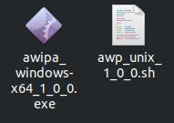
2. pada linux masuk ke terminal, untuk melakukan instalasi input:
```c
$ chmod +x awp_unix_1_0_0.sh
$ ./awp_unix_1_0_0.sh
```
3. klik next sepert pada gambar
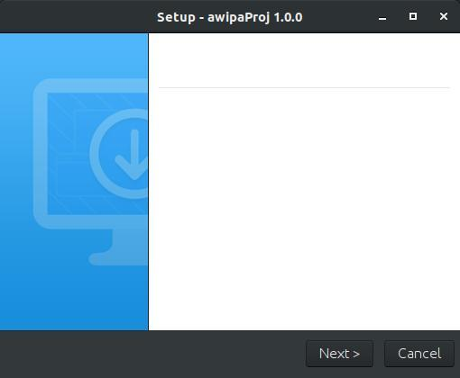
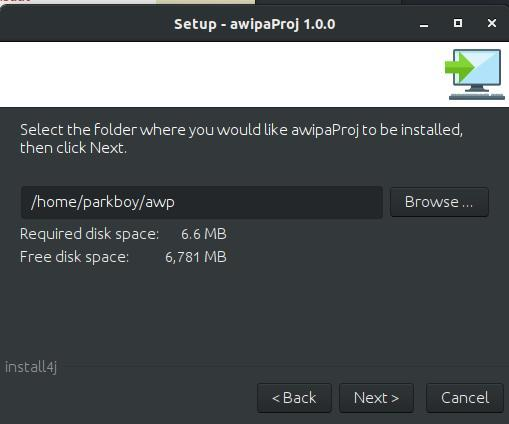
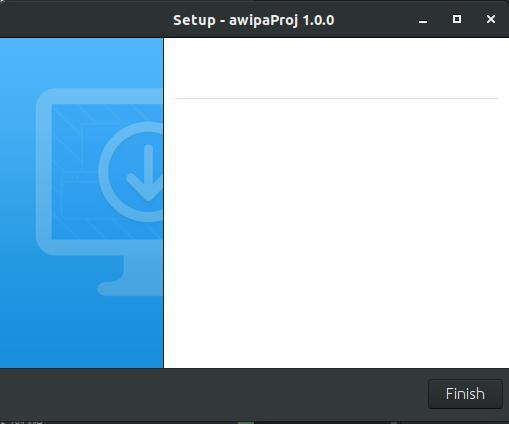
4. aplikasi sudah di install pada komputer anda\
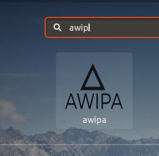

### Installation Windows
1. Download file\
2. Double klik pada aplikas untuk melakukan proses instalasi
3. klik next seperti pada gabar


### Registrasi
jika anda belum memiliki akun maka lakukan registrasi dengan melakukan klik pada tulisan di bawah tombol login\
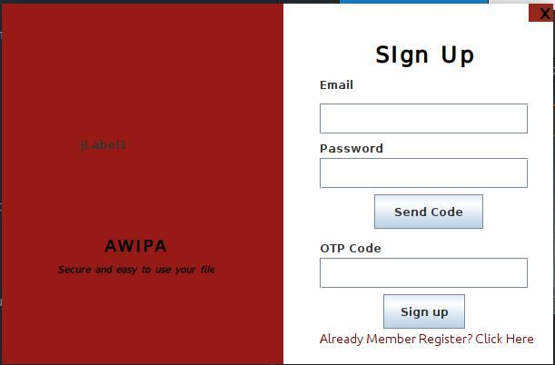
1. masukkan email dan password yang ingin anda daftarkan, lalu klik send code\
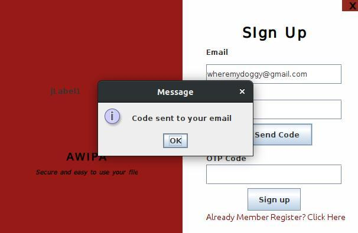
2. buka email yang kamu daftarkan untuk mendapatkan kode otp\

3. masukkan kode otp yang telah dikirimkan\
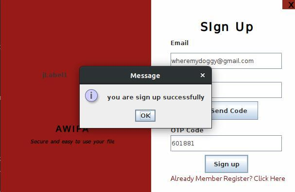

### Login
1. masukkan email dan password\
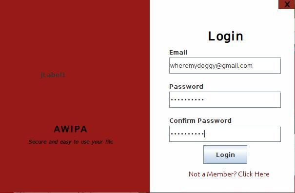
2. jika berhasil login, akan masuk pada halaman awal aplikasi\
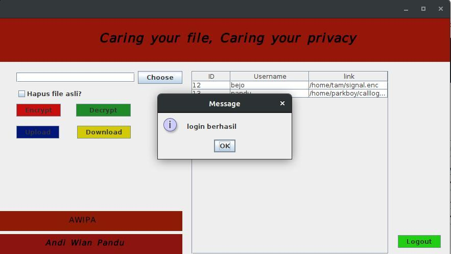

### Fitur aplikasi
##### Enkripsi
pada fitur ini *user* dapat melakukan enkripsi file yang ada pada komputer tanpa harus menyimpannya pada aplikasi serta dapat pula melakukan enkripsi pada file yang telah disimpan pada aplikasi\
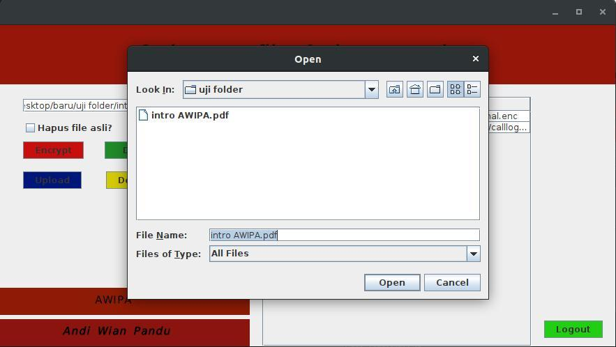\
klik tombol merah untuk melakukan enkripsi, lalu masukkan kunci untuk melakukan enkripsi\
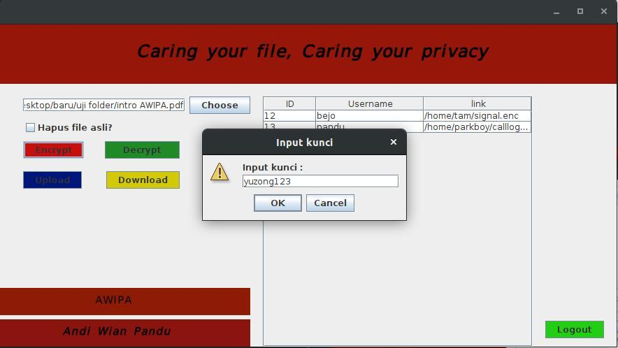
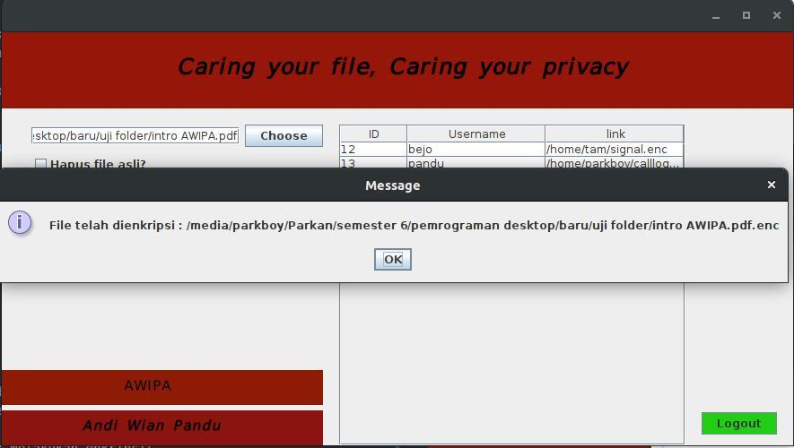\
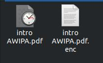

#### Dekripsi
pada fitur ini *user* dapat melakukan dekripsi file yang telah di enkripsi sebelumnya dengan menggunakan kunci yang sama\
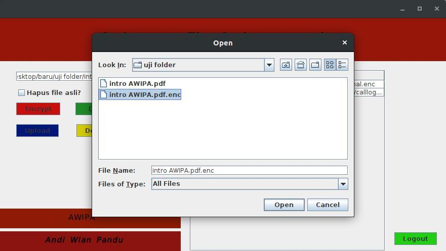
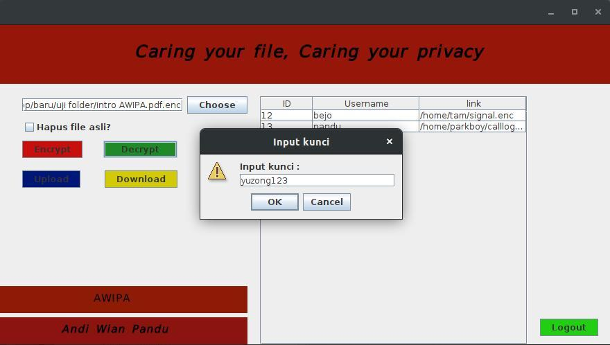
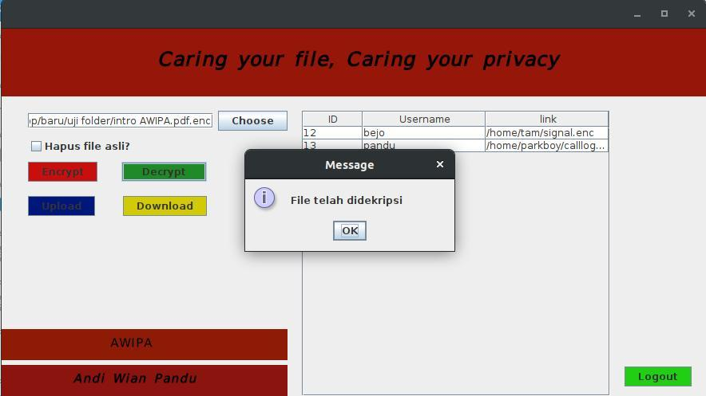

#### Upload
pada fitur ini *user* dapat melakukan penyimpanan file pada aplikasi\
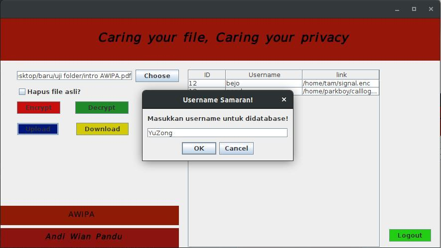
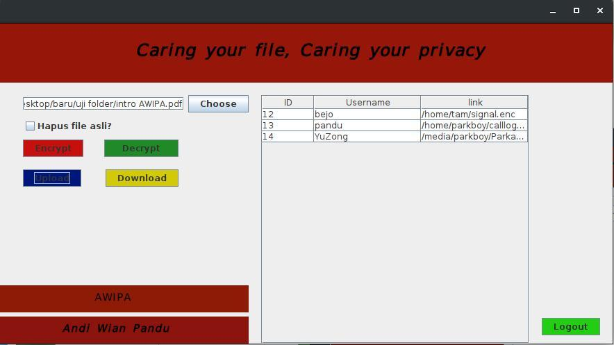

#### Download
pada fitur ini *user* dapat mendownload kembali file yang pernah di upload pada aplikasi\

### Uninstall
dapat dilakukan uninstall aplikasi dengan cara masuk ke folder hasil instalasi\
#### Linux
```c
$ ./uninstall
```


#### Windows
klik dua kali pada file uninstall.
